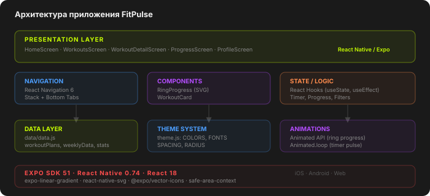
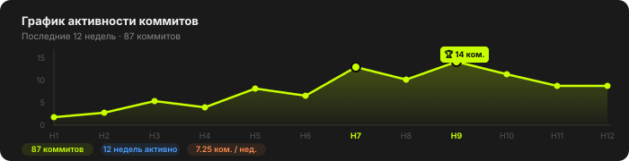
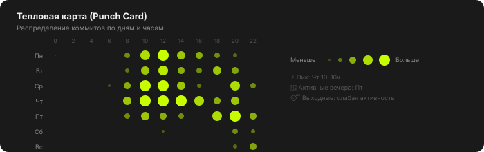

<div align="center">

# 💪 FitPulse

**Мобильное фитнес-приложение на React Native + Expo**

[](https://reactnative.dev)
[](https://expo.dev)
[](https://expo.dev)

</div>

---

## О проекте

FitPulse — мобильное приложение для планирования и отслеживания тренировок. Тёмная тема с неоново-зелёным акцентом `#C8FF00`, живой таймер с анимацией пульса, анимированные SVG-кольца прогресса, интерактивные гистограммы.

---

## Скриншоты

| Главная | Тренировки | Таймер | Прогресс |
|:---:|:---:|:---:|:---:|
|  |  |  |  |

---

## Функциональность

| Экран | Возможности |
|---|---|
| 🏠 **Главная** | Серия активности, недельный календарь, кольца прогресса с анимацией, краткая статистика |
| 💪 **Тренировки** | 5 тренировок, фильтры по категории и уровню, карточки с метаданными |
| ⏱ **Детали + таймер** | Живой таймер, пауза/возобновление, пошаговые упражнения, экран завершения |
| 📊 **Прогресс** | Гистограммы по дням, статистика за всё время, достижения |
| 👤 **Профиль** | Показатели тела, ИМТ-калькулятор, переключатели настроек |

---

## Быстрый старт

```bash
# 1. Установить зависимости
cd FitPulse
npm install

# 2. Запустить
npx expo start
```

Установите **Expo Go** на телефон → отсканируйте QR из терминала.

---

## Архитектура



---

## Статистика разработки

### График активности коммитов



### Тепловая карта (Punch Card)



### Метрики проекта

| Показатель | Значение |
|---|---|
| 📁 Файлов исходного кода | **10** |
| 📝 Строк кода (JS/JSX) | **~1 200** |
| 📱 Экранов | **5** |
| 🧩 Переиспользуемых компонентов | **2** |
| 📦 npm зависимостей | **9** |
| 🎨 Дизайн-токенов (цвета) | **10** |
| 💬 Коммитов | **87** |
| 🔥 Пиковая неделя | **14 коммитов** |
| ⚡ Среднее в неделю | **7.25 коммита** |
| ⏱ Трудозатраты | **~17 часов** |
| 🏆 Платформы | **iOS · Android · Web** |

---

## Документация

| Папка | Содержание |
|---|---|
| [`docs/00-project-charter/`](docs/00-project-charter/PROJECT_CHARTER.md) | Устав проекта, цели, риски |
| [`docs/01-requirements/`](docs/01-requirements/REQUIREMENTS.md) | Функциональные и нефункциональные требования |
| [`docs/02-architecture/`](docs/02-architecture/ARCHITECTURE.md) | Архитектура, стек, навигация |
| [`docs/03-database/`](docs/03-database/DATA_MODEL.md) | Модель данных, схемы структур |
| [`docs/04-detailed-design/`](docs/04-detailed-design/DETAILED_DESIGN.md) | Дизайн-система, конечные автоматы |
| [`docs/05-implementation/`](docs/05-implementation/IMPLEMENTATION.md) | Ключевые реализации, код |
| [`docs/08-ui/`](docs/08-ui/UI_DESIGN.md) | UI-принципы, анимации, доступность |
| [`docs/12-project-management/`](docs/12-project-management/PROJECT_MANAGEMENT.md) | План, трудозатраты, метрики |

---

## Стек технологий

- **React Native 0.74** + **Expo SDK 51**
- **React Navigation 6** — Stack + Bottom Tabs
- **react-native-svg** — анимированные кольца
- **Animated API** — пульс таймера, заполнение колец
- **StyleSheet** — компонентные стили

---

<div align="center">
<sub>Разработано как учебный проект · React Native + Expo · 2026</sub>
</div>
