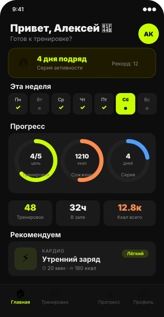
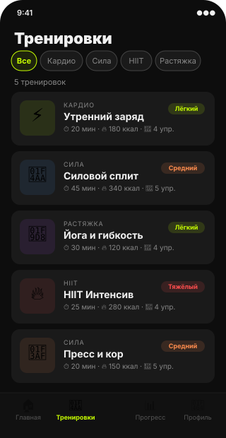
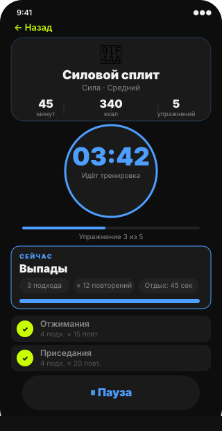
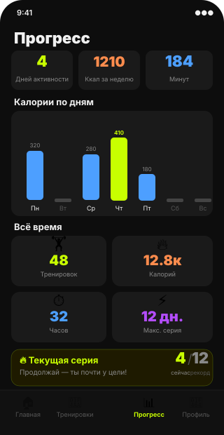

# 📱 UI Дизайн — FitPulse

## Скриншоты экранов

### Главный экран

### Тренировки

### Таймер тренировки

### Прогресс

---

## Дизайн-принципы

### 1. Dark-first
Единственная тема — тёмная. Фон `#0D0D0D` — почти чёрный, но не 100%, что снижает усталость глаз.

### 2. Неоновый акцент как сигнал
`#C8FF00` используется исключительно для активных состояний: текущий день, выполненные цели, прогресс. Это обучает пользователя «зелёный = хорошо».

### 3. Цветовая система уровней
| Уровень | Цвет | Смысл |
|---|---|---|
| Лёгкий | `#C8FF00` | Зелёный = безопасно |
| Средний | `#FF8C4D` | Оранжевый = умеренно |
| Тяжёлый | `#FF4D4D` | Красный = интенсивно |

### 4. Информация через размер
Кольца прогресса, гистограммы и бейджи передают информацию визуально без необходимости читать цифры.

### 5. Минимум текста в навигации
Bottom tab bar содержит только иконку и короткий лейбл. Активная вкладка подсвечивается цветом, а не рамкой.

## Анимации

| Элемент | Анимация | Длительность |
|---|---|---|
| Кольца прогресса | Заполнение при загрузке | 1200 мс |
| Таймер (работает) | Пульсация ×1.08 | 800 мс loop |
| Карточки | activeOpacity 0.85 | нативный |
| Навигация | slide_from_right | системный |

## Доступность

- Минимальный размер тапа: 44×44 pt
- Цветовой контраст текста: > 4.5:1 (WCAG AA)
- Активные элементы имеют визуальный feedback (`activeOpacity`)
